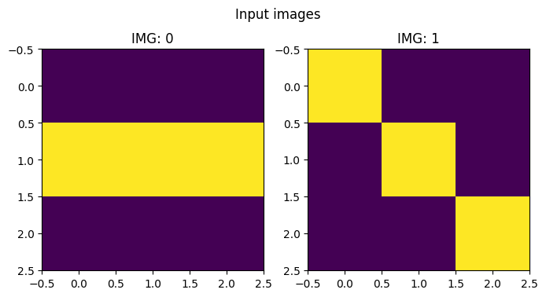
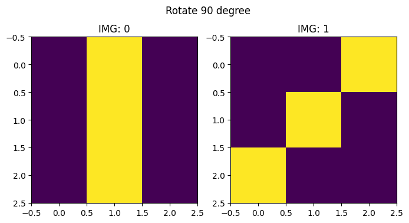

# spellops


<!-- WARNING: THIS FILE WAS AUTOGENERATED! DO NOT EDIT! -->

## Testing utilities

``` python
import io
from contextlib import redirect_stdout

def test_eq_stdout(f, expected):
    """
    Test if the output of function `f` matches the expected string.
    
    Args:
        f (callable): A parameterless function that prints to stdout.
        expected (str): The expected printed output.
    
    Raises:
        AssertionError: If the output does not match the expected string.
    """
    buffer = io.StringIO()
    with redirect_stdout(buffer):f()
    output = buffer.getvalue().strip()
    test_eq(output,expected)
```

``` python
from fastcore.test import test_fail

def my_function(): print("Hello, world!")

# Successful test
test_eq_stdout(my_function, "Hello, world!")

# Failing test
test_fail(lambda: test_eq_stdout(my_function, "Hello, world ?"))
```

## `tee` operator

`tee` is a debugging and documentation tool that prints the current
state of data transformation while allowing the chain to continue. Like
its Unix namesake, it lets you “peek” at data flowing through a pipeline
without interrupting it.

Sample use cases: 1. Debug Data Transformations 2. Document Pipeline
Steps 3. Custom Visualization 4. Development/Teaching

------------------------------------------------------------------------

### L.tee

>  L.tee (msg=None, f=<function _default_print>, show=True, **kwargs)

``` python
# Unit tests

# Default tests
test_eq_stdout(lambda:  L([1,2,3]).tee(),  "[1, 2, 3]")
test_eq_stdout(lambda:  L([1,2,3]).tee('values'),  "values\n[1, 2, 3]")
test_eq_stdout(lambda:  L([1,2,3]).tee('values', sep=':'),  "values:[1, 2, 3]")

# Advanced print
def my_print(x,msg,symbol): print(f'{symbol} {msg} : {x}')
test_eq_stdout(lambda:  L([1,2,3]).tee('values', f=my_print, symbol='!'),  "! values : [1, 2, 3]")
```

``` python
# 1. Debug Data Transformations
(L(['1.2', '3.4', '-2.1'])
    .map(float).tee('After converting to float')
    .map(abs).tee('After taking absolute values'))
```

    After converting to float
    [1.2, 3.4, -2.1]
    After taking absolute values
    [1.2, 3.4, 2.1]

    (#3) [1.2,3.4,2.1]

``` python
# 2. Document Pipeline Steps
(L(['12', 'abc', '23', '0', 'x'])
    .map(lambda x: x if x.isdigit() else None).tee('Converted to int or None')
    .filter(lambda x: x is not None).tee('Filtered out non-numbers'))
```

    Converted to int or None
    ['12', None, '23', '0', None]
    Filtered out non-numbers
    ['12', '23', '0']

    (#3) ['12','23','0']

``` python
# 3. Custom Visualization (using emoji for fun)
custom_print = lambda x, msg: print(f"🔍 {msg}: {[f'item_{i}:{v}' for i,v in enumerate(x)]}")
(L([1, 2, 3, 4])
    .map(lambda x: x*2).tee('Doubled values', f=custom_print))
```

    🔍 Doubled values: ['item_0:2', 'item_1:4', 'item_2:6', 'item_3:8']

    (#4) [2,4,6,8]

``` python
# 4. Development/Teaching
(L([{'a':1}, {'a':2}, {'a':3}])
    .tee('Starting with dictionaries')
    .map(lambda d: d['a']).tee('Extracted "a" values')
    .map(lambda x: x+10).tee('Added 10 to each value'))
```

    Starting with dictionaries
    [{'a': 1}, {'a': 2}, {'a': 3}]
    Extracted "a" values
    [1, 2, 3]
    Added 10 to each value
    [11, 12, 13]

    (#3) [11,12,13]

With `tee` you can inspect the state of your pipeline with arbitrary
complex functions:

``` python
import numpy as np

def print_as_matrix(x:L, msg):
    print(msg)
    N = len(x)
    rows = len(x[0])
    for r in range(rows):
        row_str = (L([o[r] for o in x]).map(lambda o: ''.join(map(str,o))))
        row_str = '  '.join(row_str)
        print(row_str)

# Sums all the values of the first row of all matrices after rotating them of 90 degree
(L([[[0,0,0],[1,1,1],[0,0,0]],[[1,0,0],[0,1,0],[0,0,1]]])   .tee('Input images',f=print_as_matrix)
    .map(lambda x: np.rot90(x,k=1))     .tee('Rotate 90 degree',f=print_as_matrix)
    .map(lambda x: x[0].tolist())       .tee('Take first row')
    .map(sum)                           .tee('Sum element in list')
    .sum()
)
```

    Input images
    000  100
    111  010
    000  001
    Rotate 90 degree
    010  001
    010  010
    010  100
    Take first row
    [[0, 1, 0], [0, 0, 1]]
    Sum element in list
    [1, 1]

    2

`tee` supports even rich “inspection” with external libraries such as
`matplotlib`.

``` python
# Advance tee
import matplotlib.pyplot as plt
import numpy as np

def plot_images(x:L, msg):
    N = len(x)
    plt.figure(figsize=(4*N,4))
    for i,o in enumerate(x):
        plt.subplot(1,N,i+1)
        plt.imshow(o)
        plt.title(f'IMG: {i}')
    plt.suptitle(msg)

(L([[[0,0,0],[1,1,1],[0,0,0]],[[1,0,0],[0,1,0],[0,0,1]]])  .tee('Input images',f=plot_images)
    .map(lambda x: np.rot90(x,k=1)) .tee('Rotate 90 degree',f=plot_images)
)
```

    (#2) [array([[0, 1, 0],
           [0, 1, 0],
           [0, 1, 0]]),array([[0, 0, 1],
           [0, 1, 0],
           [1, 0, 0]])]





## `pipe` operator

`pipe` applies a function to the entire L collection, rather than to
individual elements (like `map` does). With `wrap=True` (default) it
returns an L for chaining, with `wrap=False` it returns the raw result.

**NOTE:** `pipen(f)` is an alias to `pipe(f,wrap=False)`

------------------------------------------------------------------------

### L.starpipe

>  L.starpipe (f, wrap=True)

------------------------------------------------------------------------

### L.pipe

>  L.pipe (f, wrap=True)

``` python
test_eq(L([1,2,3]).pipe(len),L(3))
test_eq(L([1,2,3]).pipe(len, wrap=False),3)
test_eq(L([1,3]).starpipe(lambda a,b: a+b),L(4))
test_eq(L([1,3]).starpipe(lambda a,b: a+b, wrap=False),4)
```

------------------------------------------------------------------------

### L.starpipen

>  L.starpipen (f)

------------------------------------------------------------------------

### L.pipen

>  L.pipen (f)

``` python
test_eq(L([1,2,3]).pipen(len),3)
test_eq(L([1,3]).starpipen(lambda a,b: a+b),4)
```

``` python
# Count how many elements of a reference set are present in a L
L([1,2,3,2]).pipe(lambda x: set(x).intersection({1,3,5})).pipe(len,wrap=False)
```

    2

``` python
L(['a', 'b', 'c']).pipe('->'.join, wrap=False)
```

    'a->b->c'

``` python
# Using the convenience `pipen`
L(['a', 'b', 'c']).pipen('->'.join)
```

    'a->b->c'

You can solve this line by line and have it documented step by step:

``` python
# Count how many elements are present in both sublists using a function with two parameters
(L([[1,2,3,2],[2,4,1]])    .tee('input')
     .map(set)             .tee('to set')
     .starpipe(set.intersection)  .tee('common elements')
     .pipe(len, wrap=False)
)
```

    input
    [[1, 2, 3, 2], [2, 4, 1]]
    to set
    [{1, 2, 3}, {1, 2, 4}]
    common elements
    [1, 2]

    2

Or you can abstract part of the computation away and have it delegated
to a custom function:

``` python
# Count how many elements are present in both sublists using a function with two parameters
def count_intersection(a,b): return len(set(a)&set(b))
L([[1,2,3,2],[2,4,1]]).starpipe(count_intersection,wrap=False)
```

    2

## `unwrap` operator

`unwrap` safely extracts a single value from an L collection, returning
None for empty lists and raising an error if there are multiple
elements. It’s designed to safely terminate L-chains when you expect
exactly one result.

------------------------------------------------------------------------

### L.unwrap

>  L.unwrap ()

``` python
test_eq(L([1]).unwrap(),1)
test_eq(L([]).unwrap(),None)
test_fail(lambda: L([1,2]).unwrap())
```

``` python
# Count how many elements are present in both sublists
(L([[1,2,3,2],[2,4,1]])    .tee('input')
     .map(set)             .tee('to set')
     .starpipe(set.intersection)  .tee('common elements')
     .pipe(len)            .tee('count elements')
     .unwrap()
)
```

    input
    [[1, 2, 3, 2], [2, 4, 1]]
    to set
    [{1, 2, 3}, {1, 2, 4}]
    common elements
    [1, 2]
    count elements
    [2]

    2
